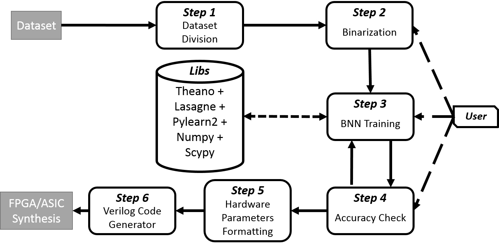

# Combinational BNN toolchain with resource-optimized architecture build tool.

Part of paper: "(Tadej Murovic, Andrej Trost), Resource-Optimized Combinational Binary Nerual Network Circuits"
--> Not yet published.

------------------------------------------------------------------------------------------------------------------
**Framework for building combinational Verilog circuits for binary neural networks.**

The main file implementing the above image is the MATLAB file FPGA_deployment_framework.m. In it we have three individual parts, which build Verilog models for spcific edge processing applications (imaging, cybersecurity, and high energy physics). Before running certain libraries and dependencies are needed.

- Matlab R2017a
- Python 2.7
  - Theano
  - Lasagne
  - Pylearn2
  - Numpy 
  - Scypy

Newest python dependencies versions should work. In case of issues take a look at https://github.com/MatthieuCourbariaux/BinaryNet/tree/master/Train-time. This is from one of the original papers on binary neural networks, from which our python training scripts are taken (only slightly modified for our purposes). For our case GPUs are not needed as the networks are relatively small. GPU training can be supported by modifying the scripts.

----------------------------
**Step 1-2**

Files cybersecurity_dataset_unswb15.m, hep_dataset_susy.m, and imaging_dataset_mnist.m are scripts that binarize our datasets and divide them into training, testing, and validation sets for cybersecurity, high energy physics, and imaging, respectively. Taken from https://github.com/TadejMurovic/BNN_Deployment, which is part of "T. Murovič, A. Trost, Massively Parallel Combinational Binary Neural Networks for Edge Processing, Elektrotehniški vestnik, vol. 86, no. 1-2, pp. 47-53, 2019" where an in-depth explanation of these scripts is given.
